# 👾 SimonOS (v0.0.2)

> **Turn your life into a video game.**

> The open-source, retro-terminal operating system for your personal portfolio.


## 📖 About

**SimonOS** is a "Headless Operating System" built for developers who want a portfolio that stands out in a sea of generic SaaS landing pages.

It combines the performance of **Astro** (static HTML) with the interactivity of **React** (focus modals) to create a retro-futuristic console interface. It features a config-driven architecture, meaning you can add projects, tools, and blog posts without touching the core code—just edit a JSON file.

## ✨ Key Features

- **🎮 Retro Terminal Aesthetic:** CRT scanlines, neon glow, and pixel fonts (`Press Start 2P`, `VT323`).

- **🎨 Dynamic Theming System:** Fully customizable themes with support for custom colors, backgrounds, and icon sets. Switch themes programmatically or create your own.

- **🖼️ Custom Icon Support:** Use theme-specific image icons or built-in Lucide icons. The neon theme includes 24+ custom icons for a cohesive retro-futuristic look.

- **📱 Responsive Design:** Fully responsive layout that adapts beautifully from mobile to desktop with breakpoint-optimized spacing, typography, and grid layouts.

- **⚡️ Zero-Database:** Content is managed via `src/config` (JSON) and `src/content` (Markdown).

- **🏝️ Islands Architecture:** The inventory grid is static HTML (fast); Modals are React Islands (interactive).

- **📦 Infinite Inventory:** Scalable grid system that handles 10 or 10,000 items.

- **🎮 Console Interface:** A centralized 'Inventory Grid' navigation style inspired by RPG menus.

- **🔍 Focus Modals:** Clicking an item opens a focused, centered overlay (No dragging, just pure focus).

- **🔌 Mini-App Registry:** Built-in system to map JSON keys to interactive React components (Calculators, Converters, Games).

## 🏗️ Architecture

SimonOS follows a "Config-as-Data" pattern.

```mermaid
graph TD
    Config[⚙️ config/inventory.ts] -->|Builds| Grid[STATIC: Inventory Grid]
    Config -->|Maps IDs| Registry[DYNAMIC: App Registry]

    User[👤 User] -->|Clicks Item| Store[🧠 Nano Store]
    Store -->|Sets Active ID| Overlay[⚛️ App Overlay]

    Overlay -->|Mounts| Modal[🔍 FocusModal]
    Registry -->|Injects Code| Modal
```



## 🛠️ Tech Stack

**Core:** Astro (Static Site Generation)

**UI Logic:** React (Modals, Boot Sequence)

**State:** Nano Stores (Shared state)

**Styling:** Tailwind CSS + Framer Motion

**Runtime:** Bun 1.3+ (Recommended) or Node.js 22+

## 🚀 Getting Started

### Prerequisites

Node.js 22+ or Bun 1.3+

### Installation

**Clone the repository**

```bash
git clone https://github.com/splieseis/simon-os.git
cd simon-os
```

**Install dependencies**

```bash
bun install
# or npm install
```

**Start the Dev Server**

```bash
bun run dev
```

## ⚙️ Customization

You can make this OS your own by editing the files in `src/config`.

### 1. Update Personal Info

Edit `src/config/site.ts` to change the site title, SEO description, and social links.

### 2. Add Your Items

Edit `src/config/inventory.ts`. This is your database.

```typescript
export const inventory = [
  {
    id: 'my-project',
    type: 'project',
    title: 'My Cool App',
    description: 'A description of what I built.',
    icon: 'rocket', // Lucide icon name or custom theme icon
    link: 'https://github.com/...'
  },
  // Add as many as you want!
]
```

### 3. Customize Themes

SimonOS includes a powerful theming system. The default "Neon Matrix" theme comes with:
- Custom background image
- 24+ custom icons (WebP format)
- Custom color palette

To create your own theme or modify existing ones, see the [Theming Guide](./THEMING.md).

**Quick Theme Setup:**
1. Add your theme folder: `public/assets/themes/{theme-id}/`
2. Add background image and icons
3. Configure in `src/config/themes.ts`
4. Switch themes programmatically via `setTheme('theme-id')`

## 📂 Project Structure

```
/src
├── apps/            # The Registry (Your 100 Tools)
├── components/
│   ├── astro/       # STATIC Components (Grid, Taskbar)
│   └── react/       # INTERACTIVE Components (Modals, Boot)
├── config/          # USER DATA (Edit this!)
├── content/         # Long form content (Blog/MDX)
├── store/           # Nano Stores (State Management)
└── types/           # TypeScript Definitions
```

## 🗺️ Roadmap

- [x] Kernel: Boot Sequence & Asset Loading
- [x] Desktop: Inventory Grid & CRT Effects
- [x] Theming System: Dynamic theme configuration with custom assets
- [x] Custom Icons: Theme-specific icon support (24+ icons in neon theme)
- [x] Responsive Design: Mobile-first responsive layout improvements
- [ ] App Overlay: Console-style modal interactions
- [ ] Registry: Tool mapping system
- [ ] Cartridge Club: Webring implementation

## 🤝 Contributing

This project acts as a template. If you fork it to build your own portfolio, please submit a PR to add yourself to the Cartridge Club roster!

## 📄 License

MIT © Simon Plieseis
