# 👾 SimonOS Portfolio (v0.1.0)

> **Your retro-terminal developer portfolio.**

> The open-source, pixel-art operating system for developers who refuse boring portfolios.


## 📖 About

**SimonOS Portfolio** is a retro-terminal portfolio template built for developers who want a portfolio that stands out in a sea of generic pages and cvs.

It combines the performance of **Astro** (static HTML) with the interactivity of **React** (focus modals) to create a retro-futuristic console interface. It features a config-driven architecture, meaning you can add projects, tools, and blog posts without touching the core code—just edit a JSON file.

## ✨ Key Features

- **🎮 Retro Terminal Aesthetic:** CRT scanlines, neon glow, and pixel fonts (`Press Start 2P`, `VT323`).

- **🎨 Dynamic Theming System:** Fully customizable themes with support for custom colors, backgrounds, and icon sets. Switch themes programmatically or create your own.

- **🖼️ Custom Icon Support:** Use theme-specific image icons or built-in Lucide icons. The neon theme includes 24+ custom icons for a cohesive retro-futuristic look.

- **📱 Responsive Design:** Fully responsive layout that adapts beautifully from mobile to desktop with breakpoint-optimized spacing, typography, and grid layouts.

- **⚡️ Zero-Database:** Content is managed via `src/config` (JSON) and `src/content` (Markdown).

- **🏝️ Islands Architecture:** The inventory grid is static HTML (fast); Modals are React Islands (interactive).

- **📦 Infinite Inventory:** Scalable grid system that handles 10 or 10,000 items.

- **🎮 Console Interface:** A centralized 'Inventory Grid' navigation style inspired by RPG menus.

- **🔍 Focus Modals:** Clicking an item opens a focused, centered overlay with CRT effects. Press ESC or click outside to close.

- **🔌 Mini-App Registry:** Built-in system to map JSON keys to interactive React components (Calculators, Converters, Games).

- **👤 About Me Page:** Beautiful, customizable About Me page with sections for bio, skills, interests, and social links. Fully configurable via `src/config/about-me.ts`.

- **📄 CV/Resume with PDF Download:** Professional CV display with PDF download button. Customize via `src/config/cv.ts` and place your PDF in `public/assets/`.

- **🔗 Flexible Action System:** Each inventory item can be a direct link, iframe (for mini-apps), component overlay, or download action. Fully configurable and template-friendly.

- **🎵 Background Music:** Per-theme background music system with simple play/pause toggle. Music files are theme-specific and automatically loop. Click the music icon in the header to start playing.

## 🏗️ Architecture

SimonOS Portfolio follows a "Config-as-Data" pattern.

```mermaid
graph TD
    Config[⚙️ config/inventory.ts] -->|Builds| Grid[STATIC: Inventory Grid]
    Config -->|Maps IDs| Registry[DYNAMIC: App Registry]

    User[👤 User] -->|Clicks Item| Store[🧠 Nano Store]
    Store -->|Sets Active ID| Overlay[⚛️ App Overlay]

    Overlay -->|Mounts| Modal[🔍 FocusModal]
    Registry -->|Injects Code| Modal
```



## 🛠️ Tech Stack

**Core:** Astro (Static Site Generation)

**UI Logic:** React (Modals, Boot Sequence)

**State:** Nano Stores (Shared state)

**Styling:** Tailwind CSS + Framer Motion

**Runtime:** Bun 1.3+ (Recommended) or Node.js 22+

## 🚀 Getting Started

### Prerequisites

Node.js 22+ or Bun 1.3+

### Installation

**Clone the repository**

```bash
git clone https://github.com/splieseis/simon-os-portfolio.git
cd simon-os-portfolio
```

**Install dependencies**

```bash
bun install
# or npm install
```

**Set up GitHub Stats (Optional)**

To display your GitHub commit stats (all-time total commits and last commit time), you'll need a GitHub Personal Access Token:

1. Go to [GitHub Settings > Developer settings > Personal access tokens > Tokens (classic)](https://github.com/settings/tokens)
2. Generate a new token
3. Check the **`repo`** scope (to access private repositories) and **`read:user`** (to read profile stats)
   - **Note:** You do NOT need `user:email` - the API doesn't read email addresses
4. Create a `.env` file in the project root and add:

```bash
GITHUB_TOKEN=ghp_your_secret_token_here
```

**Environment Variables:**
- **`GITHUB_TOKEN`** (optional): Your GitHub Personal Access Token for fetching commit statistics
  - If not provided, stats will show `0` commits gracefully
  - The token is only used server-side during build and never exposed to clients
  - Make sure `.env` is in your `.gitignore` (it already is!)
- **`GITHUB_STATS_MAX_YEARS`** (optional): Maximum years of commit history to fetch (default: `10`)
  - Example: `GITHUB_STATS_MAX_YEARS=20` to query last 20 years
  - Higher values = more complete counts but slower builds (more API calls)

**Important Notes:**
- **Year Limit:** By default, only the **last 10 years** of commits are counted (to prevent excessive API calls)
  - Set `GITHUB_STATS_MAX_YEARS` in your `.env` to increase this limit
  - Due to GitHub API limitations, each year requires a separate API call
- **Dynamic Updates:** Stats automatically refresh for visitors without rebuilding!
  - Initial page load shows build-time stats (fast)
  - After 1 second, fresh stats are fetched from `/api/github-stats`
  - API responses are cached for 15 minutes to reduce GitHub API calls
  - **Hosting:** Requires a platform that supports serverless functions (Vercel, Netlify, Cloudflare Pages, etc.)
- **Email Association:** The `contributionsCollection` API aggregates commits based on your GitHub account identity. If you've pushed commits with multiple emails, make sure all those email addresses are:
  - Verified in your GitHub account
  - Added to your account's email settings (Settings > Emails)

Commits made with emails not associated with your GitHub account won't be counted in the total.

**Start the Dev Server**

```bash
bun run dev
```

## ⚙️ Customization

You can make this portfolio your own by editing the files in `src/config`.

### 1. Update Personal Info

Edit `src/config/site.ts` to change the site title, SEO description, and social links.

### 2. Add Your Items

Edit `src/config/inventory.ts`. This is your database. Each item can have different action types:

```typescript
export const inventory: InventoryItem[] = [
  // Direct link (opens in new tab)
  {
    id: 'github',
    type: 'social',
    title: 'GitHub',
    icon: 'github',
    action: 'link',
    link: 'https://github.com/yourusername'
  },
  
  // Component overlay (like About Me)
  {
    id: 'about-me',
    type: 'experience',
    title: 'About Me',
    icon: 'about-me',
    action: 'component',
    componentKey: 'AboutMe'
  },
  
  // Iframe (for mini-apps deployed elsewhere)
  {
    id: 'my-mini-app',
    type: 'mini-app',
    title: 'My Mini App',
    icon: 'apps',
    action: 'iframe',
    link: 'https://my-app.vercel.app'
  },
  
  // Download (component with PDF download button)
  {
    id: 'my-cv',
    type: 'writing',
    title: 'CV / Resume',
    icon: 'cv',
    action: 'download',
    componentKey: 'CV',
    downloadPath: '/assets/cv.pdf' // Place PDF in public/assets/
  },
  
  // Add as many as you want!
]
```

**Action Types:**
- `'link'`: Opens external URL in new tab (for social profiles, external sites)
- `'iframe'`: Opens URL in iframe overlay (for mini-apps deployed elsewhere)
- `'component'`: Opens React component in overlay (for custom content)
- `'download'`: Opens component with PDF download button (for CV/Resume)

### 3. Customize CV / Resume

Edit `src/config/cv.ts` to add your CV/resume information. The CV component displays beautifully in the overlay and includes a download button for your PDF.

**To add your PDF:**
1. Place your PDF file in `public/assets/cv.pdf`
2. Update the `downloadPath` in your inventory item: `downloadPath: '/assets/cv.pdf'`

All fields in the CV config are optional - only include what you want to display.

### 4. Customize About Me Page

Edit `src/config/about-me.ts` to personalize your About Me page. All fields are optional - only include what you want to display:

```typescript
export const aboutMeConfig: AboutMeConfig = {
  name: 'Your Name',
  tagline: 'Your tagline here',
  bio: ['Your bio paragraph 1', 'Your bio paragraph 2'],
  currentRole: 'Your Role',
  location: '🌍 Your Location',
  skills: ['Skill 1', 'Skill 2', 'Skill 3'],
  interests: ['Interest 1', 'Interest 2'],
  socials: {
    github: 'https://github.com/yourusername',
    linkedin: 'https://linkedin.com/in/yourusername',
    // ... more socials
  },
  funFacts: ['Fun fact 1', 'Fun fact 2'],
};
```

The About Me page will automatically update when you modify this config file.

### 5. Customize Themes

SimonOS Portfolio includes a powerful theming system. The default "Neon Matrix" theme comes with:
- Custom background image
- 24+ custom icons (WebP format)
- Custom color palette

To create your own theme or modify existing ones, see the [Theming Guide](./THEMING.md).

**Quick Theme Setup:**
1. Add your theme folder: `public/assets/themes/{theme-id}/`
2. Add background image and icons
3. Add music file (optional): `public/assets/themes/{theme-id}/music.mp3`
4. Configure in `src/config/themes.ts` (add `music: 'music.mp3'` to assets)
5. Switch themes programmatically via `setTheme('theme-id')`

## 📂 Project Structure

```
/src
├── apps/            # The Registry (Your 100 Tools)
├── components/
│   ├── astro/       # STATIC Components (Grid, Taskbar)
│   └── react/       # INTERACTIVE Components (Modals, Boot)
├── config/          # USER DATA (Edit this!)
├── content/         # Long form content (Blog/MDX)
├── store/           # Nano Stores (State Management)
└── types/           # TypeScript Definitions
```

## 🗺️ Roadmap

- [x] Kernel: Boot Sequence & Asset Loading
- [x] Desktop: Inventory Grid & CRT Effects
- [x] Theming System: Dynamic theme configuration with custom assets
- [x] Custom Icons: Theme-specific icon support (24+ icons in neon theme)
- [x] Responsive Design: Mobile-first responsive layout improvements
- [x] App Overlay: Console-style modal interactions
- [x] Registry: Tool mapping system
- [x] Background Music: Per-theme music system with play/pause toggle
- [ ] Cartridge Club: Webring implementation

## 🤝 Contributing

This project acts as a template. If you fork it to build your own portfolio, please submit a PR to add yourself to the Cartridge Club roster!

## 📄 License

MIT © Simon Plieseis
